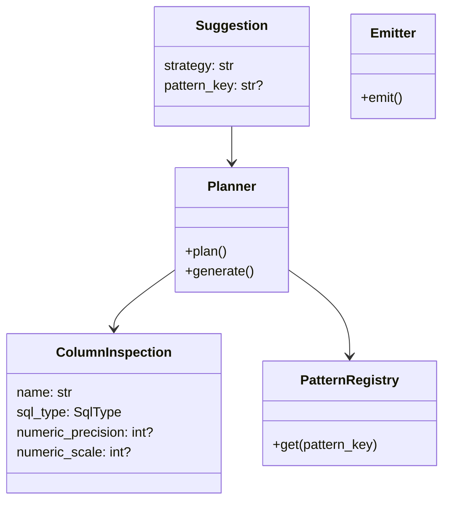

```mermaid
classDiagram
    class ColumnInspection {
        name: str
        sql_type: SqlType
        numeric_precision: int?
        numeric_scale: int?
    }

    class Suggestion {
        strategy: str
        pattern_key: str?
    }

    class Planner {
        +plan()
        +generate()
    }

    class PatternRegistry {
        +get(pattern_key)
    }

    class Emitter {
        +emit()
    }

    Suggestion --> Planner
    Planner --> ColumnInspection
    Planner --> PatternRegistry
```