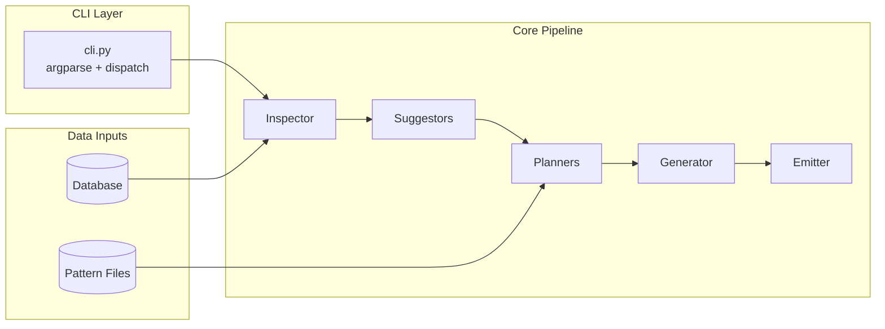

# Component Diagram

```mermaid
flowchart LR
    subgraph CLI[CLI Layer]
        A[cli.py\nargparse + dispatch]
    end

    subgraph CORE[Core Pipeline]
        B[Inspector]
        C[Suggestors]
        D[Planners]
        E[Generator]
        F[Emitter]
    end

    subgraph DATA[Data Inputs]
        G[(Database)]
        H[(Pattern Files)]
    end

    A --> B --> C --> D --> E --> F
    G --> B
    H --> D
```
