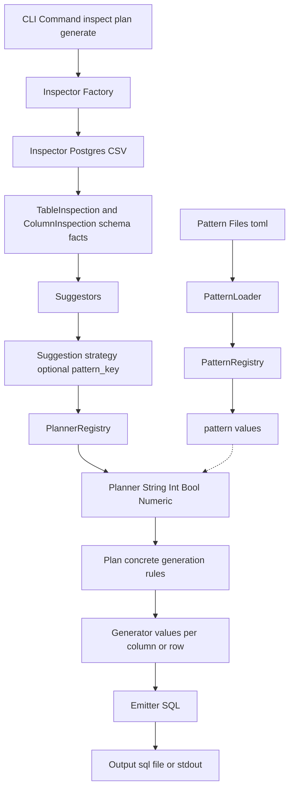

```mermaid
flowchart TD
    A[CLI Command inspect plan generate] --> B[Inspector Factory]
    B --> C[Inspector Postgres CSV]
    C --> D[TableInspection and ColumnInspection schema facts]

    D --> E[Suggestors]
    E --> F[Suggestion strategy optional pattern_key]

    F --> G[PlannerRegistry]
    G --> H[Planner String Int Bool Numeric]

    H --> I[Plan concrete generation rules]
    I --> J[Generator values per column or row]

    J --> K[Emitter SQL]
    K --> L[Output sql file or stdout]

    P[Pattern Files toml] --> Q[PatternLoader]
    Q --> R[PatternRegistry]
    R --> S[pattern values]
    S -.-> H
```
