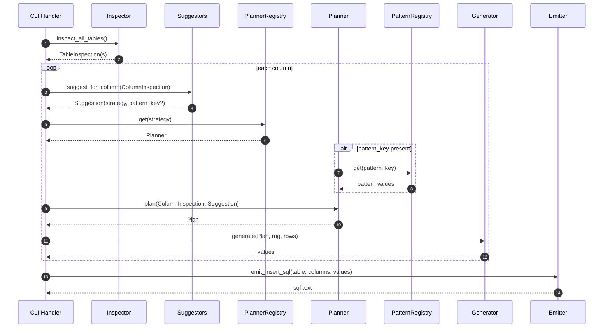

# Sequence Diagram

```mermaid
sequenceDiagram
    autonumber
    participant CLI as CLI Handler
    participant INS as Inspector
    participant SUG as Suggestors
    participant REG as PlannerRegistry
    participant PLN as Planner
    participant PAT as PatternRegistry
    participant GEN as Generator
    participant EMT as Emitter

    CLI->>INS: inspect_all_tables()
    INS-->>CLI: TableInspection(s)

    loop each column
        CLI->>SUG: suggest_for_column(ColumnInspection)
        SUG-->>CLI: Suggestion(strategy, pattern_key?)

        CLI->>REG: get(strategy)
        REG-->>CLI: Planner

        alt pattern_key present
            PLN->>PAT: get(pattern_key)
            PAT-->>PLN: pattern values
        end

        CLI->>PLN: plan(ColumnInspection, Suggestion)
        PLN-->>CLI: Plan

        CLI->>GEN: generate(Plan, rng, rows)
        GEN-->>CLI: values
    end

    CLI->>EMT: emit_insert_sql(table, columns, values)
    EMT-->>CLI: sql text
```
